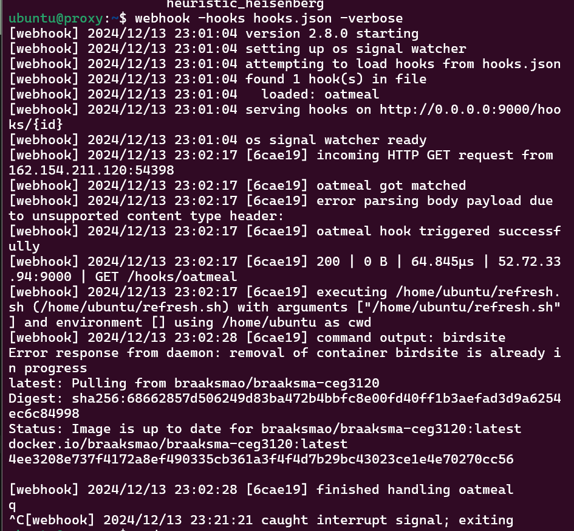
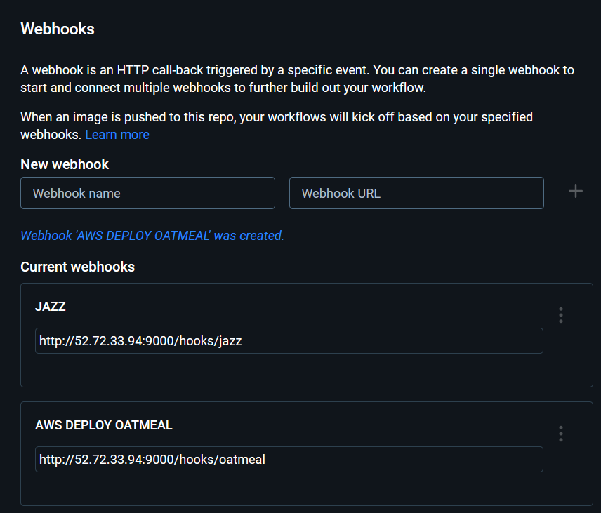
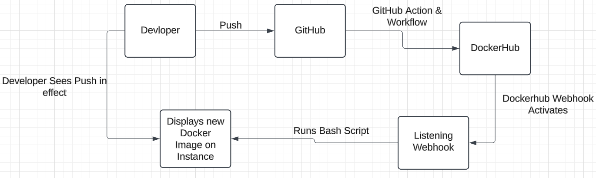
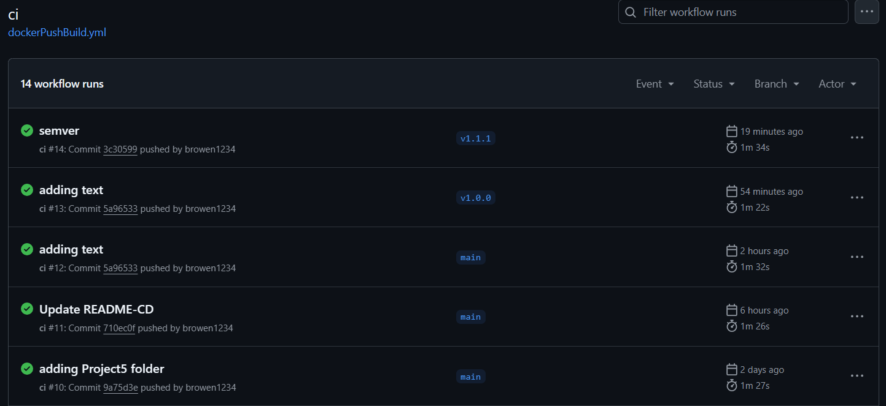

# Project 5
## Owen Braaksma

## Part 1: Semantic Versioning

### Description
This project the goal was to be able to use semantic versioning for images and webhooks to automatically tag the developers updates for them. This way the developer doesn't have to go through and tag every single thing along with make sure all the pushed data is done correctly. 

### Generate and Push Tags
After you commit a new changes to your git repo, it should be tagged. This done by doing specfic tagging commands through git. Below I will list the order on how I did my tags, once I figured out the proper why to do them.

git tag -a v1.1.1 -m "Version 1.1.1 New Patch"
git push origin main
git push origin v1.1.1

It is better to be safe and be more complex than to miss something, that is why I have some extra text rather than just the essentials needed.

### Behavior of GitHub Workflow
Whenever there is a push to the main branch gitHub will take the update the image on DockerHub. This is done through the GitHub action that was set up during Project 4. 
### DockerHub Repo Link

https://hub.docker.com/repository/docker/braaksmao/braaksma-ceg3120/general

## Part 2: Deployment

### Instance Information:
    - Public IP: 52.72.33.94
    - OS: Ubuntu
    - Other data: Running the small.t2 instead of the micro

### Installing Docker on the Instance
Installing docker using the command line for the instance was a several step process. Started by updating and upgrading my system. Then installing the required packages. Added the Docker Repo, updated again because of the new installed packages, then installed docker. Lastly verified the version of docker and that it was started and enabled on the system. Lastly gave my user on Ubuntu permission so I didn't have to do sudo the entire time. 

Here are the commands I used in order:

- sudo apt update
- sudo apt upgrade -y
- sudo apt install -y apt-transport-https ca-certificates curl software-properties-common
- curl -fsSL https://download.docker.com/linux/ubuntu/gpg | sudo gpg --dearmor -o /usr/share/keyrings/docker-archive-keyring.gpg
echo "deb [arch=$(dpkg --print-architecture) signed-by=/usr/share/keyrings/docker-archive-keyring.gpg] https://download.docker.com/linux/ubuntu $(lsb_release -cs) stable" | sudo tee /etc/apt/sources.list.d/docker.list > /dev/null
- sudo apt update
- sudo apt install -y docker-ce docker-ce-cli containerd.io
- docker --version
- sudo systemctl start docker
- sudo systemctl enable docker
- sudo usermod -aG docker $USER

### Using the bash script
The purpose of the bash script is to stop and remove an existing image and then replace it with the latest version of that image. Inside the script I used basic docker commands that get ran whenever the script is called for. The script is located in ubuntu/home/

[DEPLOYMENT FOLDER](/Project5/deployment/)

### Installing adnahn's Webhook on the Instance
Installing adnahn's Webhook was used to be able to receive request and the perform tasks asked by the me, the devloper. Installing the webhook was very simple and easy. I then used systemctl to make sure the webhook was installed correctly. Commands used: 
sudo apt install webhook
systemctl status webhook

### Explanation of the Contents of the Webhook
Within the Webhook theres an ID that when called when the hook is running will execute a command. The command that it is set to is the bash script that we wrote that is talked about above. Also within the is a trigger rule that activates when it sees the latest tag on DockerHub. This file is located in the same spot as the bash script at /home/ubuntu.

[DEPLOYMENT FOLDER](/deployment/)

### Starting the Webhook
The webhook is started by running it in the instance. It will then listen for the jazz or oatmeal hook to be called. 

### Testing the Listner on the Webhook
This can be tested when calling the oatmeal hook and I have added a screenshot below. 

### Configuring DockerHub to Message the Listener
In DockerHub I have two different Webhooks set to activate when Dockerhub detacts a change in the image. 

### Modifying the Webhook to Listen on System Boot
I changed my hooks.json file and added a part at the bottom that allows for the system to start to listen. 

## Part 3: Diagramming

### Here are my diagram of the deployment process 

Over all what is happening is the devloper is pushing a change to GitHub. That will trigger a GitHub Action and Workflow that will take the tag version and push that new image to DockerHub. This will add a new tagged version and a latest version. DockerHub the activates one of its webhooks then the listening webhook on the instance will trigger. This will then run the bash script that will display the newly updated Docker image on the instance. Then the devloper can load the url of the instance and see their accomplished work. 

## Where I Failed
Semantic Versioning was not working. I troubleshooted for a good 5 hours and couldn't get anywhere. I went through lectures websites, even tested chatGPTs mind but nothing worked. The closest I got broke my other workflow and I'm unsure how that even works. I have a screenshot of when it was working and I will add a [failed](/failed/) folder in Project 5 with the text file inside that has the copied code within. Not sure if you will give points but here is what I had.

So with Semantic Versioning not fully working I am unable to get mutiple versions of my DockerHub image. But I do like to think that I understand how everything works way better than when I started the project. Unfortunately I can't seem to understand how to make it work. I even changed it back and fourth 3 times. 

## Resources

https://github.com/adnanh/webhook/blob/master/README.md
https://docs.docker.com/engine/install/ubuntu/